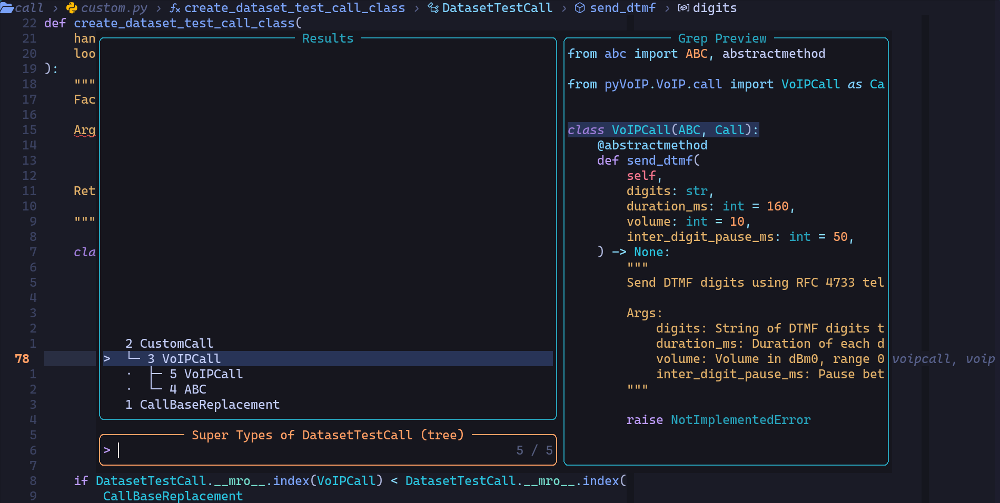
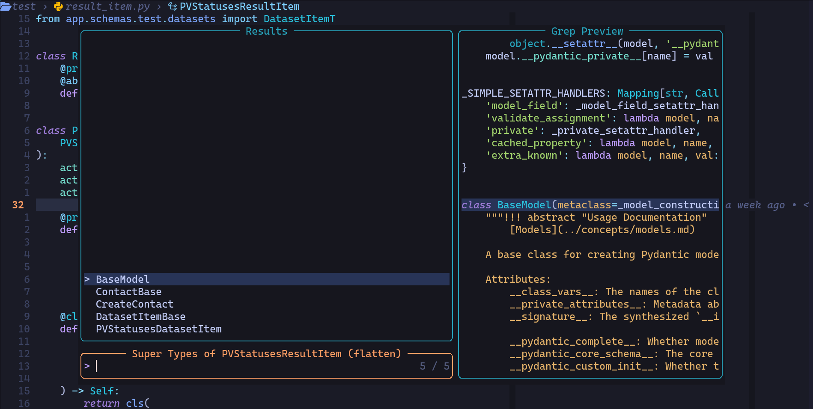
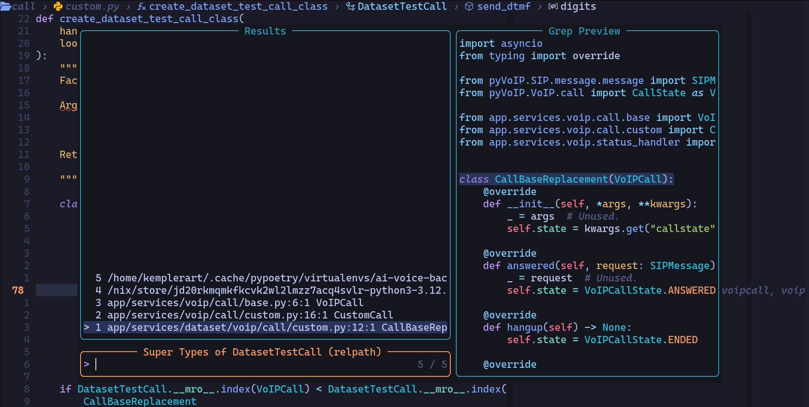

# telescope-py-super-types.nvim

Telescope extension for inspecting Python inheritance hierarchies (super types)
directly from your cursor position. Purpose is to try to add support for the
missing `typeHierarchy/supertypes` and related `pyright` LSP features.

This extension analyzes the class under your cursor, recursively resolves its
base classes using Treesitter and LSP, computes the Python Method Resolution
Order (C3 linearization), and displays the results in a
[Telescope](https://github.com/nvim-telescope/telescope.nvim) picker.

> [!WARNING]
> Tested with [`pyright`](https://github.com/microsoft/pyright) and Python.
> However, this extension is LSP-agnostic and might be suitable for other
> languages too if the super type resolution algorithm implemented here is
> applicable.

## What It Does

When your cursor is inside a Python class:

1. Uses Treesitter to detect the enclosing class_definition
2. Extracts immediate base classes
3. Uses LSP `textDocument/definition` to jump to base class definitions (cross-file supported)
4. Recursively builds a full inheritance tree
5. Computes C3 linearization (Python MRO algorithm)
6. Displays the result in Telescope with multiple presentation styles

This means:

- Works across files and modules (as long as LSP can resolve them)
- Shows hierarchical inheritance order
- Lets you jump directly to super type class definition

## Install

### lazy.nvim

```lua
{
  "KirilStrezikozin/telescope-py-super-types.nvim",
  dependencies = {
    "nvim-telescope/telescope.nvim",
    "nvim-treesitter/nvim-treesitter",
  },
  config = function()
    require("telescope").load_extension("py_super_types")
  end,
}
```

## Usage

Three presentation styles are supported: `tree` (default), `flatten`, and `relpath`.
You can customize the default during setup:

```lua
require("telescope").setup({
  extensions = {
    py_super_types = {
      style = "tree",
    },
  },
})
```

```vim
:Telescope py_super_types
```



```vim
:Telescope py_super_types style=flatten
```



```vim
:Telescope py_super_types style=relpath
```



