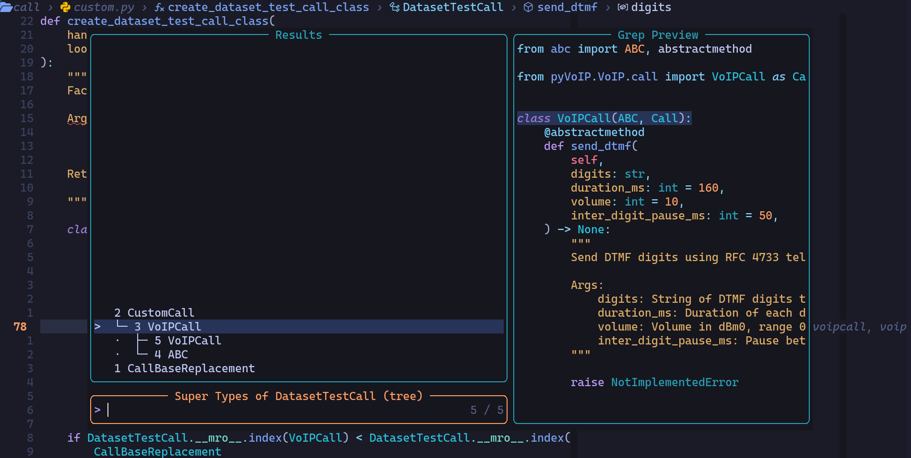
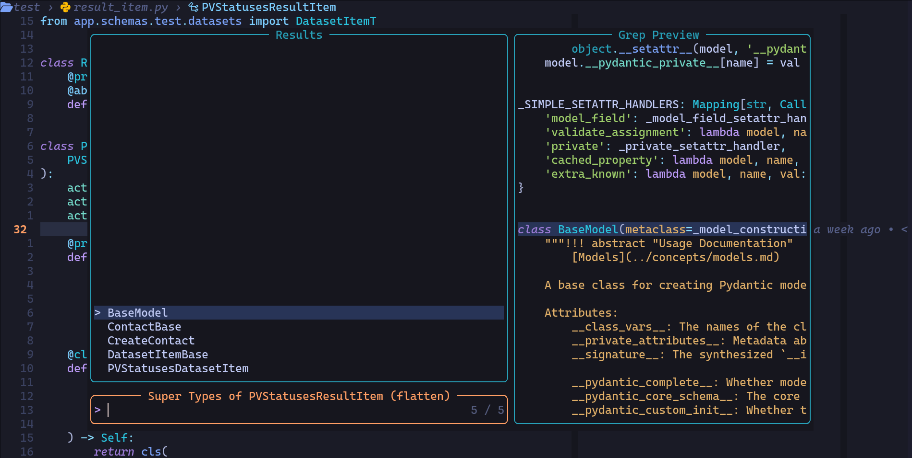
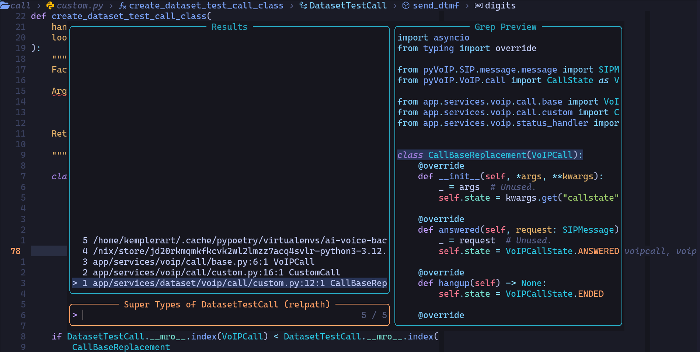

# telescope-py-super-types.nvim

Telescope extension for inspecting Python inheritance hierarchies (super types)
directly from your cursor position. Purpose is to try to add support for the
missing `typeHierarchy/supertypes` and related `pyright` LSP features.

This extension analyzes the class under your cursor, recursively resolves its
base classes using Treesitter and LSP, computes the Python Method Resolution
Order (C3 linearization), and displays the results in a
[Telescope](https://github.com/nvim-telescope/telescope.nvim) picker.

> [!WARNING]
> Tested with [`pyright`](https://github.com/microsoft/pyright) and Python.
> However, this extension is LSP-agnostic and might be suitable for other
> languages too if the super type resolution algorithm implemented here is
> applicable.

## What It Does

When your cursor is inside a Python class:

1. Uses Treesitter to detect the enclosing `class_definition`
2. Extracts immediate base classes
3. Uses LSP `textDocument/definition` to jump to base class definitions
4. Recursively builds a full inheritance tree
5. Computes C3 linearization (Python MRO algorithm)
6. Displays the result in Telescope

This means:

- Finds base classes across files and modules in your project (as long as LSP can resolve them)
- Shows hierarchical inheritance order
- Lets you pick a base class definition to jump to from Telescope

## Install

### lazy.nvim

```lua
{
  "KirilStrezikozin/telescope-py-super-types.nvim",
  dependencies = {
    "nvim-telescope/telescope.nvim",
    "nvim-treesitter/nvim-treesitter",
  },
  config = function()
    require("telescope").load_extension("py_super_types")
  end,
}
```

## Usage

Three presentation styles are supported: `tree` (default), `flatten`, and `relpath`.
You can customize the default during setup:

```lua
require("telescope").setup({
  extensions = {
    py_super_types = {
      style = "tree",
    },
  },
})
```

Example configuration together with the `telescope` setup in `lazy`:

```lua
{
  'nvim-telescope/telescope.nvim',
  dependencies = {
    -- Your other telescope dependencies here...

    -- Include this extension as a dependency of telescope
    { 'KirilStrezikozin/telescope-py-super-types.nvim' },
  },
  config = function()
    require('telescope').setup({
      extensions = {
        -- Your other telescope extension configs here...

        -- Optional. Configure the defaults for this extension
        py_super_types = {
          style = "tree", -- default presentation style: "tree", "flatten", or "relpath"
        },
      },
    })

    -- Load the extension. Must come after you configured extension defaults above.
    require("telescope").load_extension("py_super_types")

    -- Rest of your telescope config...
  end,
}
```

### Invocation commands

```vim
:Telescope py_super_types
```



```vim
:Telescope py_super_types style=flatten
```



```vim
:Telescope py_super_types style=relpath
```



### Example keybinds

```lua
vim.keymap.set('n', '<leader>st', "<cmd>Telescope py_super_types<cr>", { desc = 'Search [S]uper [T]ypes' })
```

```lua
vim.keymap.set("n", "<leader>st", function()
  require("telescope").extensions.py_super_types.py_super_types({
    style = "tree",
  })
end, { desc = "Search [S]uper [T]ypes" })
```

